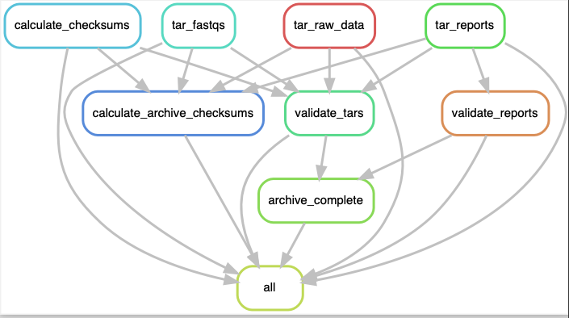

# Sequencing automations

A [snakemake](https://snakemake.readthedocs.io) pipeline that performs archiving and transfer of Nanopore sequencing data.

## What it does



The pipeline identifies project directories, determines whether each sample under the directory has finished its run, then performs archiving, checksum calculation, validation and ultimately transfers the archives to a specified [Globus](https://www.globus.org/) endpoint. The pipeline is intended to be run on the Nanopore sequencing machine's PC, and can be set up to periodically run as a cron job.

**NOTE: Exercise caution if running this in a production environment. Make sure you test the functionality thoroughly before implementing.**

## Workflow details

The pipeline checks for finished Nanopore sequencing runs by finding run directories under project directories (these will be under `/data`). The format of these directories can be specified in the config file via a regular expression. Our sequencing facility uses the following format for projects:

`YYYYMMDD_affiliation_lab_project`

Optionally, you may wish to specify directly the directories to archive, which can be done by setting `ignore_project_regex: True` and adding your project directories in a YAML list to `extra_dirs:`. You can also ignore project directories by adding them to `ignore_dirs`. 

The pipeline will check for the presence of the sequencing summary file, which indicates that the run has finished (the regex of the file the pipeline looks for can be changed in the config) with an optional time delay (i.e., the pipeline will only process the run if N seconds have passed since the file was modified).

The file types handled can also be specified in the config, and includes reports/metadata, fastq, pod5, fast5 and checksums. Bam files are currently not handled, so you will have to deal with these manually.

The pipeline checks each tar file and outputs the files present to a text file. This is useful for validation. The `tar_file_counts.txt` and `system_file_counts.txt` files are created once archiving is complete, and lets you check that the counts on the file system and within your tar files matches. 

Using the transfer automation requires setting up [Globus](https://www.globus.org/) endpoints. Refer to the [Globus documentation](https://docs.globus.org/) on how to do this. You will also have to manually authenticate on your first run of the pipeline. Make sure to set `transfer: True` if you want to use this, as well as your `src_endpoint`, `dest_endpoint` and `dest_path`. 

## Installation

The only prerequisite is [snakemake](https://snakemake.readthedocs.io/en/stable/getting_started/installation.html). To install snakemake, you will need to install a Conda-based Python3 distribution. For this, [Mambaforge](https://github.com/conda-forge/miniforge#mambaforge) is recommended. Once mamba is installed, snakemake can be installed like so:

```
mamba create -c conda-forge -c bioconda -n snakemake snakemake
```

Now activate the snakemake environment (you'll have to do this every time you want to run the pipeline):

```
conda activate snakemake
```

To reduce the possibility of conda interfering with the sequencer's software, it is safer to disable conda in the `~/.bashrc` and load it manually (you can put this in your run script): `source /home/prom/mambaforge/etc/profile.d/conda.sh`.

Now clone the repository:

```
git clone https://github.com/WEHIGenomicsRnD/nanopore-transfer-automation.git
cd nanopore-transfer-automation
```

## Testing

You can test the pipeline as follows:

```bash
cd .test && python make_test_data.py && cd ..
snakemake --cores 4 --directory .test --config data_dir=$PWD/.test/test_data
```

## Configuration

The configuration file is found under `config/config.yaml`. Make sure this is carefully reviewed.

## Running

Run the pipeline using the `run.sh` script. It is recommended to first run with a `--dry-run` to make sure everything looks okay:

```bash
snakemake --cores 1 --dry-run
```

## Output

The pipeline will produce a `_transfer` directory under each project for transfer. This can then be transferred via `rsync` manually, or in an automated fashion using the Globus transfer built into the pipeline.

**NOTE: make sure your sequencer has enough disk space to accommodate the archive files, this means each 1TB run will need 1TB free space to perform the archiving.**
