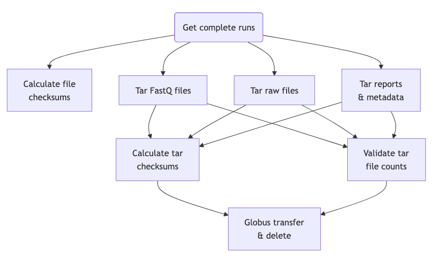

# Summary

Oxford Nanopore Technologies (ONT) sequencing is rapidly gaining popularity in various fields, including genomics, transcriptomics, metagenomics and pathogen detection [@wang2021]. The technology involves passing strands of DNA or RNA through an engineered protein pore to generate an electrical signal, which is decoded by deep learning algorithms to read base sequences, as well as modifications such as methylation.

ONT can be undertaken on small instruments (such as the MinION) in decentralised locations but is also increasingly being deployed at higher throughput in core labs as a service, particularly on PromethION instruments capable of housing 2, 24 or 48 flow cells, allowing for more concurrent runs. In addition, unlike other forms of sequencing, the accuracy of the base-calling models can depend on sequence context, sequence origin and the availability of computing resources at the time of sequencing, so while basecalling is usually done in near-real-time, it is often necessary to keep and transfer raw data to storage to enable later, more accurate re-analysis. As a result, nanopore sequencers have a data footprint ~10x larger than that of base-called reads (corresponding to ~1.7 TiB for a ~40x coverage human genome sample) [@jayasooriya2025].

For the above reasons, data transfer of ONT data is a non-trivial problem and is often made more complex due to network security restrictions that allow sequencing machines only limited access to internal networks. The Nanopore Transfer Automation pipeline is designed to streamline the process of packaging and moving ONT data in a robust and error-tolerant way from the sequencing computer to the destination via an automatable snakemake [@koster2012] pipeline that interfaces with Globus [@chard2014] for data transfers.

# Statement of need

Nanopore sequencers generate large amounts of data. Due to security requirements and isolated instrument networks, it can be non-trivial to move data from sequencing machines to destination areas in the local network in a timely, automated and error-tolerant way. NFS (Network File System) is a potential solution for streaming data from an instrument such as the PromethION to a designated network location, however, may not be possible in some cases due to security restrictions. To facilitate streaming of raw and processed data on to local storage, ONT sequencers typically create numbers of small files under run directories, resulting in many fast5/pod5 and fastq files that correspond to a single run. Destination file systems, particularly those that are backed up to tape, perform sub-optimally with large numbers of small files.

To address these problems, we have developed an automatable snakemake pipeline that handles tarring of these files into a small number of archives per run, performing checksum calculation and integrity checking, and then transfering the data between the source (the sequencing machine) and the destination network location (\autoref{fig:workflow}). The tool is able to run periodically, scanning for new runs, checking that they are complete, and performing any archiving operations for finished runs. The workflow need not be run on the source machine. For example, it could be used solely as a packaging tool on the destination-side of the network, which is particularly useful for long-term storage, and for sending sequencing data to external parties. We provide a configuration that can be customised by the end-user to fit within their data naming practices and processing requirements.

The Nanopore Transfer Automation tool is designed to be used in a sequencing facility environment, and has been used to successfully process over 400 PromethION runs to date in the WEHI Genomics Advanced Genomics Facility. The tool has enabled a streamlined processing workflow that is able to save significant amount of processing time per run, while avoiding error-prone manual archiving and copying that can potentially lead to data loss. The automated system presented allows runs to be processed in a timely fashion with minimal intervention, allowing researchers to begin analysing their data sooner.

# Figures

- **Figure 1**: Workflow diagram showing processing steps in the Nanopore Transfer Automation tool.
{ width=80% }

# Acknowledgements

We acknowledge WEHI ITS and Research Computing Platform for support and consultation related to network, instrument and Globus setup, Quentin Gouil for scripts and advice on all things Nanopore, Layla Wang for testing, and Rory Bowden for advice and manuscript review. We also acknowledge Globus and ONT support for helpful advice.

# Author contributions

MC: conceptualisation, design, implementation, testing, documentation and paper writing. IG: feature implementation, testing, maintenance and review.

# References
